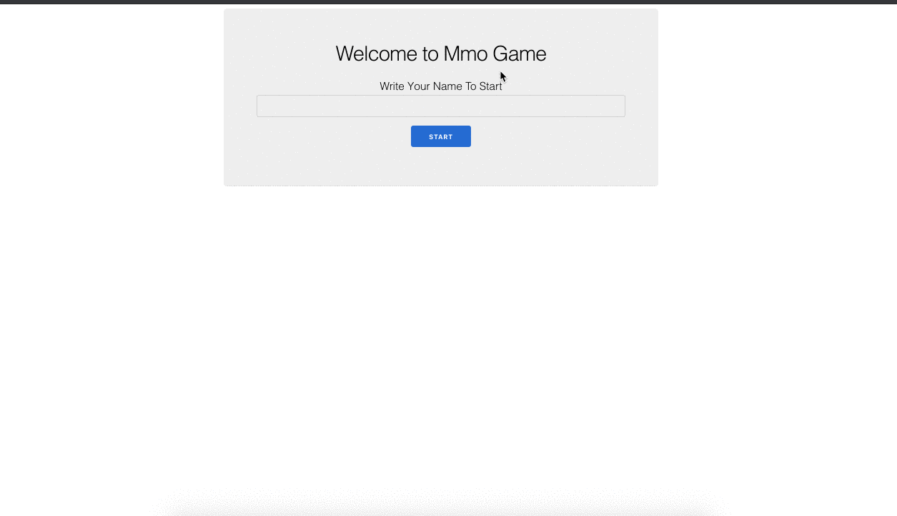

# mmo_game
MMO Board Game

## This is how it looks


## Running a live version

Just click [here](https://morning-eyrie-68469.herokuapp.com).
It might take some time to start, remember it's a free server :).

## Running the tests

Just run: `mix test`

## How to start the application

Since we don't have a datatabase, it's pretty easy to start the application locally.

1. Clone to repository `(git clone ...)`
2. Download the dependencies `mix deps.get`
3. Compile the assets (and return to folder) `cd assets && npm install && cd ..`
4. Start to service with iex `iex -S mix phx.server`
5. Go to [http://localhost:4000/](http://localhost:4000/) and have fun.

Other tips: It seems running `npm audit fix` is breaking webpack, so don't run it. Npm will complain about vulnerabilities.

## Creating a release

To run the release you need first to digest your assets by running:

```
mix phx.digest
```

After that, just set SECRET_KEY_BASE env variable and MIX_ENV to prod. Everything should work after that.
Or just run: 

```
SECRET_KEY_BASE=$(mix phx.gen.secret) MIX_ENV=prod mix release
```

To run the release:

```
PORT=4000 _build/prod/rel/mmo_game/bin/mmo_game start
```

## Running on the container and cloud

There is a `Dockerfile` on the main folder.
To build the container (you should have docker installed) just run: 

```
docker build -t mmo_game .
```

To run it later run:
```
docker run --publish 4000:4000 --env SECRET_KEY_BASE=$(mix phx.gen.secret) --env PORT=4000 mmo_game:latest 
```

This container is configured to run on heroku. With a few tweaks on the release you might be able to run ou AWS or Azure.

## How it was implemented

### UI

The ui is really simple. The hero the user is controlling is shown on green and bold text. The enemies are shown on red.
Whenever a hero dies, we apply the ~~strikethrough~~ effect on the name (you can see on the gif above).

When you load the game page, the service will reload after 1s or after each move/attack of your hero.
Sometimes, because of this reloading, you might try to move and think it's not working, but it's basically because it started reloading before you clicked the button.

### MmoGame: lib/mmo_game.ex

Exposes the API the web server needs to access. Those are the important functions.

### MmoGame.Application: lib/mmo_game/application.ex 

Basic mix application. The only difference is that we are already starting GameServer under the default supervision tree provided by phoenix.

### MmoGame.GameServer: lib/mmo_game/game_server.ex:

A genserver that keeps state of the `Grid` and the `heroes`.
If GameServer crashes, supervisor will restart it and retrieve last known state by the use of :ets table.
We have the function to add and remove heroes. Adding heroes will start a hero genserver and adds the name of the hero to `heroes` list. Removing the hero does the opposite.
If Hero crashes, whenever he is needed (for draw his position, for example), he is 'restarted'. If the user tries to move a hero that crashed, the hero will be restarted as well. The position of the hero is not persisted on the :ets table, so if he crashes he will respawn somewhere else.

### MmoGame.Grid: lib/mmo_game/grid.ex:

Implements all the grid logic, like calculating coordinates, drawing the grid (converting from our data structure to a 2d list), etc.

### MmoGame.Hero: lib/mmo_game/hero.ex

A genserver that keeps state of the hero's state `name`, `position` and `dead` (if here is dead or alive).
There is no supervisor, but it is implemented manually. Whenever a hero is needed, if his name exists on the GameServer `heroes` list but the process doesn't, we restart the hero genserver.

## Reseting the state

For now, only a server restart will remove the heroes. 
The live version on heroku has some limitations, it will restart automatically when idle for some time.